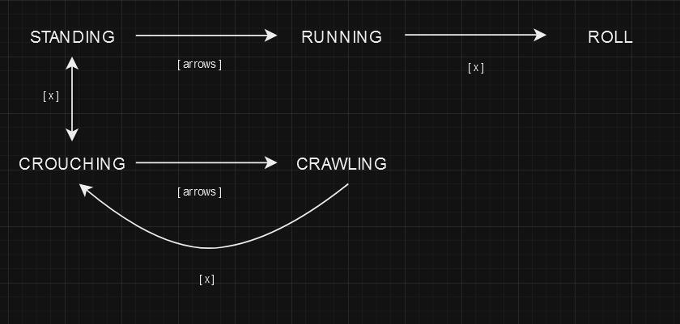

**01102024**

<iframe width="100%" height="400" src="https://www.youtube.com/embed/234c48DzAn0?si=v_WE4pDGr6xm9B6c" title="YouTube video player" frameborder="0" allow="accelerometer; autoplay; clipboard-write; encrypted-media; gyroscope; picture-in-picture; web-share" allowfullscreen></iframe>

Following [Peyton Burnham's YouTube video](https://www.youtube.com/watch?v=qTqDY4JtFfo), I was
able to get eight way moving up and running pretty quickly, along with some very basic
collision.

Sprites were ripped from The Spriter's Resource, and it wasn't too bad to get
them into sprite sheets and use as needed. They're still a bit janky, as I don't
know if they're not "perfect", or I've done something wrong (most likely the
latter). Its not a big deal, as I will reskin the entire game eventually, when
its at a good point to.

The one thing that was interesting, was the state related to the player
character. In Metal Gear games, Snake can run, crawl, and crouch. In later games
(PS2 onward) he can crouch walk, and just walk, leveraging the controller's
sticks.

I wanted to have a mix of Ghost Babel (GBC), and Metal Gear Solid (PS1) style
movement. I abandoned "rolling" pretty quick, but I may come back to that, as
that may be a fun thing to have for a boss fight. It should look something
like...


<!-- figures -->

And in code, that looks like...

```rb
// create event
// states
enum PLAYER_STATE {
    STAND = 0,
    RUN = 1,
    CROUCH = 2,
    CRAWL = 3,
};

// step event
if state == PLAYER_STATE.STAND {
    if _x_key { state = PLAYER_STATE.CROUCH; }
    if moving { state = PLAYER_STATE.RUN; }
}
else if state == PLAYER_STATE.CROUCH {
    if _x_key { state = PLAYER_STATE.STAND; }
    if moving { state = PLAYER_STATE.CRAWL; }
  }
else if state == PLAYER_STATE.RUN {
  if !moving { state = PLAYER_STATE.STAND; }
  if _x_key { state = PLAYER_STATE.CROUCH; }
}
else if state == PLAYER_STATE.CRAWL {
  if _x_key { state = PLAYER_STATE.CROUCH; }
}
```

While reasonably concise, it took a minute to get to this point. Navigating when
the player could crouch and what their options were from there, the same for
crawling and running (standing but not moving), was all a bit interesting.

Another hurdle was navigating how to do idle sprites, facing the correct way.
There is most likely a little bit of redundant code, not only in the example
here, but how I'm storing direction. This is in part due to the way that
Burnham's tutorial did movement. When the object is not moving, it defaults to a
sprite_pointer of 0. So, I had to make some copy code that memoizes that.

```rb
// create event
enum DIRECTION {
    RIGHT = 0,
    UP_RIGHT = 1,
    UP = 2,
    UP_LEFT = 3,
    LEFT = 4,
    DOWN_LEFT = 5,
    DOWN = 6,
    DOWN_RIGHT = 7,
}

direction_state = 0;

// step event
// facing direction
if _right_key && _up_key {
    direction_state = DIRECTION.UP_RIGHT;
} else if _right_key && _down_key {
    direction_state = DIRECTION.DOWN_RIGHT;
} else if _left_key && _up_key {
    direction_state = DIRECTION.UP_LEFT;
} else if _left_key && _down_key {
    direction_state = DIRECTION.DOWN_LEFT;
} else if _down_key {
    direction_state = DIRECTION.DOWN;
} else if _up_key {
    direction_state = DIRECTION.UP;
} else if _right_key {
    direction_state = DIRECTION.RIGHT;
} else if _left_key {
    direction_state = DIRECTION.LEFT;
}
```

Its not the most elegant code, but it works. And then drawing the correct sprite
looks like...

```rb
// draw event
if moving == 0 {
    if state == PLAYER_STATE.CROUCH {
        sprite_index = idle_crouch_sprite[direction_state];
    }
    else if state == PLAYER_STATE.STAND || state == PLAYER_STATE.RUN {
        sprite_index = idle_stand_sprite[direction_state];
    }
    else if state == PLAYER_STATE.CRAWL {
        sprite_index = crawl_sprite[direction_state];
    }
}

if moving == 1 {
    if state == PLAYER_STATE.RUN {
        sprite_index = run_sprite[sprite_pointer];
    }
    else if state == PLAYER_STATE.CRAWL {
        sprite_index = crawl_sprite[sprite_pointer];
    }
}
```

Again, while all this seems straightforward, it was a fun exercise to see even
a glimpse of how state works within a Metal Gear-like game.
