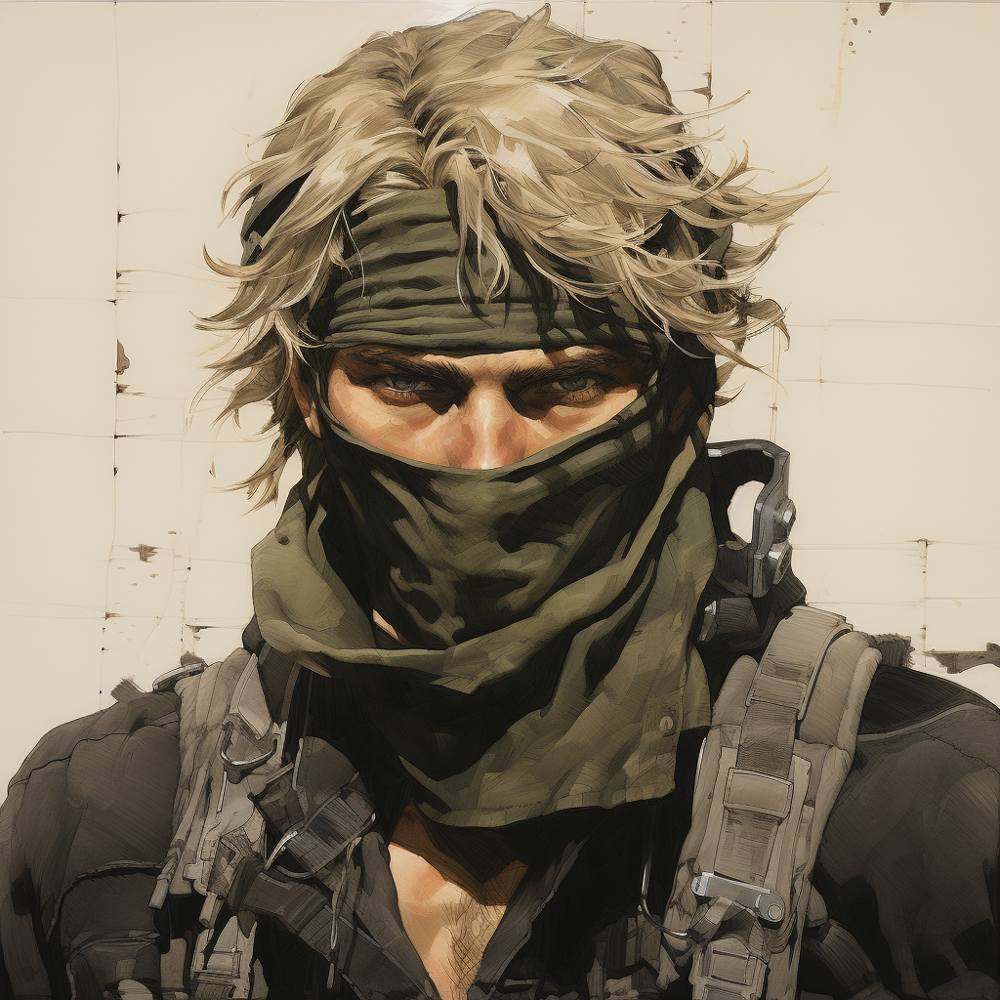

**02142024**

Its been a few weeks since my last update. To quote Dr. Ian Malcolm...

> _"Life finds a way."_

In my case, life found a way to get in the way.

#### The switch to gamepad

Like every other Metal Gear game, I've switched from keyboard input to using a gamepad. There were some
intricacies around this, but once I figured out the concept it actually wasn't too bad. One pattern
I've pursued is having a global or game object that will contain a lot of data and initialize things,
that can be leveraged in other objects. For instance, `enum` have been moved to it, finding the
controller's id, and mapping buttons to public variables that allow me to then do something akin to:

```rb
obj_global.cross_key_released
```

Instead of having to remap buttons specifically in every object. I could have done something similar
before, but this was a good opportunity to do it.

#### Gameplay updates

Two things I'm still working on are:

- The player being able to "hug" walls, akin to how Snake does in the MG series
- "Punching"

The issue with wall hugging is finding the direction I'm in contact with, moving the viewport in
that direction, rendering the correct sprite, and then not getting stuck in the wall. So, all known
issues, but there'll be some mental cycles around trying to figure out how to get it all to work.

Punching seems straightforward enough, and I've only worked on it a short time. One thing I'm looking
forward to figuring is "waiting for an animation to stop". For instance, a player should not be able
to button mash the punch button and get a new punch. They should have to wait for the anim to complete.

This will most likely be an important concept for other things in game, so its good I work out the
insides of it, and perhaps can write some good code around it to ensure that other things down the
road aren't that bad to implement.

#### Site update

If you're reading this, you may have noticed a (temporary) new url. I've re-written and re-organized.
The site is redone in [Astro](https://astro.build). It allows me to write in Markdown for logs, and other pages, and just
being able to expedite updates and staying organized.

#### Art & Music

I joined the TIGSource Discord and was able to find a pixel artist and chiptune artist. This game still
has a LONG ways to go, and it was perhaps a mistake jumping into those things so soon on those fronts.

The one nice thing is... hopefully it won't be too difficult to get assets that I like, in game, when
I am ready for all that.

I've also made a little concept for Nightjar, the main character. Additionally, just as concept art,
I used Midjourney to generate some Shinkawa-style concepts.




#### Happy Valentine's Day

Go read ["_The Parliament of Fowls_"](https://www.potw.org/archive/potw313.html) by Chaucer ❤️
